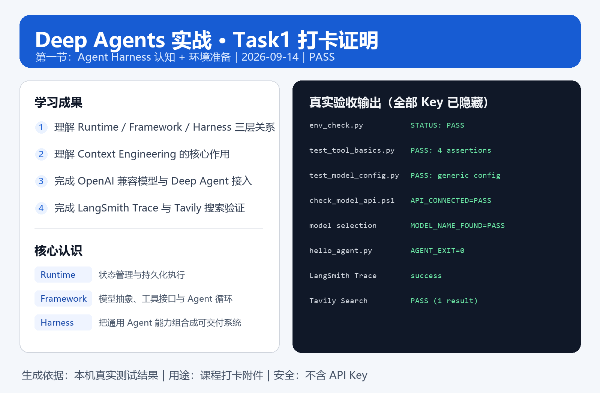

# Task1 学习笔记：从环境准备到第一个 Deep Agent

> 课程：Datawhale《Deep Agents 实战》<br>
> 打卡任务：Task1<br>
> 学习群：二群<br>
> 更新日期：2026-09-17

## 1. 这次我实际完成了什么

这次 Task1 不只是把依赖安装成功，而是完成了从环境准备、模型配置、工具调用、联网搜索到可观测调试的一条完整入门链路。我在 Windows PowerShell 中建立了独立的 Python 虚拟环境，配置了一个 OpenAI 兼容的大模型接口，并分别配置了 LangSmith 与 Tavily。随后我运行了第一个 Deep Agent，理解了 `ChatOpenAI`、`create_deep_agent()`、`tools=[...]`、`agent.invoke()` 之间的关系，也通过 LangSmith 观察 Agent 的运行过程。



上图中的 Key 均已隐藏。环境验证结果包括：

```text
env_check.py             STATUS: PASS
test_tool_basics.py      PASS: 4 assertions
test_model_config.py     PASS: generic model configuration
check_model_api.ps1      API_CONNECTED=PASS
model selection          MODEL_NAME_FOUND=PASS
hello_agent.py           AGENT_EXIT=0
LangSmith Trace          success
Tavily Search            PASS (1 result)
```

## 2. 本地程序与远程模型的边界

我现在能区分“程序在本地运行”和“模型在本地运行”不是一回事。我的 Python 程序是在本机启动的，但它会通过网络把请求发送到外部大模型 API。远程模型完成推理后，再把结果返回给本地程序，最后显示在终端或由 Agent 继续处理。

```text
本地 Python 程序
    → 读取环境变量中的模型配置
    → 通过 MODEL_BASE_URL 请求远程模型 API
    → 远程模型完成推理
    → 本地程序接收结果并继续执行
```

工具函数也在这个边界里发挥作用：模型负责判断是否需要工具、调用哪个工具、传什么参数；真正执行工具函数的是本地 Python。如果工具内部访问外部 API，例如 Tavily 搜索，那么本地工具会再发起一次网络请求。

## 3. 三层架构：Runtime、Framework、Harness

Agent 开发可以从下往上理解为三层：

```text
Deep Agents —— Harness：组合复杂 Agent 的通用工作方式
LangChain   —— Framework：提供模型、工具和 Agent 循环的标准接口
LangGraph   —— Runtime：管理状态、执行、暂停、恢复和持久化
```

我把它类比成一个工作间：Runtime 提供稳定运行所需的地基和电力；Framework 提供锤子、锯子等标准工具；Harness 则把工具、工作流程和分工方式预先组织好。三者并不是互相替代，而是逐层构建。

以前我容易把“能调用模型”理解成“已经是完整 Agent”。现在我认识到，大模型只是推理核心。一个能长期完成复杂任务的 Agent，还需要状态管理、工具调用、任务规划、文件系统、子 Agent、上下文管理和运行追踪。

## 4. Harness 的关键能力

### 文件系统

Agent 可以按需读取、搜索、写入和编辑文件，并把中间结果保存在文件中。这样不必把整个项目一次性放进模型上下文，尤其适合长任务和多文件任务。

### 任务规划

复杂任务可以拆成可跟踪的步骤。Todo 是外部任务状态，不等于模型的全部内部推理。课程所用版本需要按需配置 `TodoListMiddleware`，不是所有应用都会默认出现 `write_todos`。

### 子 Agent

主 Agent 可以把边界明确的任务交给专门的子 Agent。例如搜索、分析和写作可以分别处理，主 Agent 最后负责检查和汇总。子 Agent 还能隔离大量原始资料，避免主上下文过于混乱。

### 上下文管理

模型的上下文窗口有限。真正重要的不是把所有信息塞进 Prompt，而是决定什么信息应在什么时间交给哪个 Agent。文件按需读取、中间结果落盘、历史内容总结和子 Agent 分工，都是上下文管理手段。

## 5. Prompt Engineering 与 Context Engineering

我现在这样区分二者：

- Prompt Engineering 关注“指令应该怎么表达”；
- Context Engineering 关注“模型现在应该看到哪些信息，以及如何取得这些信息”。

一个提示词即使写得很好，如果输入的信息错误、过时、缺失或过多，结果依然可能不好。Deep Agents 通过可插拔的虚拟文件系统、工具和子 Agent，让模型只在需要时读取相关内容。文件后端可以是内存、本地磁盘、数据库或远程沙箱，而 Agent 使用的文件接口可以保持一致。

## 6. 第一个 Deep Agent 的代码结构

第一个 Deep Agent 的主线可以拆成四步：

```python
import os
from langchain_openai import ChatOpenAI
from deepagents import create_deep_agent

model = ChatOpenAI(
    api_key=os.environ["MODEL_API_KEY"],
    base_url=os.environ["MODEL_BASE_URL"],
    model=os.environ["MODEL_NAME"],
)

def get_weather(city: str) -> str:
    """Get weather for a given city."""
    return f"{city}：这是本地演示工具，请替换为真实天气 API。"

agent = create_deep_agent(
    model=model,
    tools=[get_weather],
    system_prompt="你是一个可以调用工具的助手。"
)

result = agent.invoke({
    "messages": [
        {"role": "user", "content": "北京天气怎么样？"}
    ]
})
```

我对这段代码的理解是：`ChatOpenAI` 负责连接模型；`get_weather` 是一个普通 Python 函数，但注册到 `tools` 后就变成 Agent 可用的工具；`create_deep_agent()` 把模型、工具和系统提示词组装起来；`agent.invoke()` 则启动一次完整的 Agent 运行。

## 7. 自定义工具设计：函数签名、docstring 与返回值

Deep Agents 的工具定义很直观：一个普通 Python 函数就可以成为工具。但模型不是靠阅读函数内部实现来理解工具，而是主要依赖函数名、参数名、类型标注、默认值、docstring 和返回值。

```python
def internet_search(query: str, max_results: int = 5) -> dict:
    """Search the internet for information related to the user's query."""
    ...
```

这段工具定义里，`query: str` 告诉模型搜索关键词应该是字符串；`max_results: int = 5` 告诉模型最多返回几条结果，并且这个参数有默认值；`-> dict` 表示返回结构化结果；docstring 告诉模型什么时候应该调用这个工具。

我现在可以用一句话概括工具设计：**函数签名告诉模型怎么调用，docstring 告诉模型什么时候调用，返回值告诉模型拿到什么结果。**

## 8. 计算器 Agent：最小工具调用闭环

计算器 Agent 的意义不是学会计算，而是看懂工具调用闭环。课程中的工具通常类似：

```python
def calculate(expression: str) -> float:
    """Calculate a mathematical expression."""
    return eval(expression)
```

当用户问“23 * 17 等于多少”时，Agent 的过程可以拆成：

```text
用户问题
→ 模型判断这是计算任务
→ 模型生成工具调用 calculate(expression="23 * 17")
→ 本地 Python 执行 calculate
→ 工具返回 391
→ 模型根据工具结果组织最终回答
```

这里我特别注意到：模型负责判断和组织，本地程序负责真正执行工具。课程中用 `eval()` 是为了演示方便，但生产环境不能直接对用户输入使用 `eval()`，否则可能执行不该执行的 Python 代码。真实项目中应该使用更安全的数学解析方式或限制可执行表达式。

## 9. Tavily 研究助手：把外部信息接入 Agent

Tavily 可以理解成给 Agent 使用的搜索 API。普通人通过浏览器搜索，Agent 则通过工具函数调用 Tavily：

```text
模型判断需要搜索
→ 调用 internet_search 工具
→ 本地 Python 请求 Tavily API
→ Tavily 返回搜索结果
→ 模型整理成答案
```

这与计算器工具的区别在于：`calculate` 是纯本地执行，而 `internet_search` 虽然也是本地 Python 函数，但函数内部会访问外部搜索服务。也就是说，本地程序是入口，大模型负责判断，Tavily 负责提供外部资料。

我也进一步理解了三个 Key 的分工：

```text
MODEL_API_KEY      调用大模型，让模型推理和生成答案
TAVILY_API_KEY     调用搜索 API，让工具联网查资料
LANGSMITH_API_KEY  上传运行记录，让我查看 Agent Trace
```

## 10. LangSmith Trace：把黑盒运行变成可观察过程

Agent 的最终答案只能说明“它给了一个结果”，但不能说明结果是怎么来的。LangSmith 的价值在于记录完整运行过程，例如用户输入、模型调用、工具调用、参数、返回值、最终答案和错误信息。

我现在会重点看这条链路：

```text
User Input
→ LLM Run
→ Tool Call
→ Tool Output
→ Final Answer
```

如果 Agent 没有调用工具，我会检查 `tools=[...]` 是否注册、docstring 是否清楚、模型是否支持 tool calling。如果工具调用了但参数错了，我会检查参数名、类型标注和 docstring。如果工具返回了正确结果但最终答案不好，我会优先检查 system prompt 和模型能力。

我还踩过一个 LangSmith 配置坑：把 Markdown 链接格式写进了环境变量，例如 `[https://api.smith.langchain.com](https://api.smith.langchain.com)`。环境变量里应该保存纯 URL：`https://api.smith.langchain.com`。这让我意识到 `PRESENT` 只表示变量存在，不等于接口一定可用。

## 11. 模型选择：Agent 更看重工具调用稳定性

不是所有大模型都适合跑 Agent。普通聊天只要求模型能生成回答，而 Agent 还要求模型稳定完成工具选择、参数生成、多步骤推理和结果整合。

我现在判断模型是否适合当前课程，会按这个顺序看：

```text
1. API 能不能连上
2. 模型 ID 是否存在
3. 简单对话能不能返回
4. 简单工具能不能调用
5. 工具参数是否正确
6. 多步骤任务是否稳定
7. LangSmith Trace 是否能看到完整过程
```

OpenAI 兼容接口的意义也更清楚了：`ChatOpenAI` 像一个通用插头，`MODEL_BASE_URL` 决定插到哪个平台，`MODEL_NAME` 决定使用哪个模型，`MODEL_API_KEY` 决定是否有权限调用。这样代码不用绑定某一个模型平台，后续切换模型也更方便。

## 12. 我的分层排错方法

完成 Task1 后，我建立了一个比较清晰的排错顺序：

```text
程序启动不了：看 Python 环境、依赖包、路径、虚拟环境
模型连不上：看 MODEL_API_KEY、MODEL_BASE_URL、MODEL_NAME
模型不调用工具：看 tools 注册、docstring、tool calling 能力
工具调用失败：看工具函数内部逻辑、API Key、网络请求
搜索失败：看 TAVILY_API_KEY 和 Tavily 返回结果
Trace 上传失败：看 LANGSMITH_API_KEY、ENDPOINT、PROJECT
最终答案不好：看 system_prompt、模型能力、工具返回内容
```

这套方法让我从“看到报错就乱试”变成“按层定位问题”。对生产级 Agent 来说，能运行只是第一步，能观察、能定位、能复现、能修复才是更重要的能力。

## 13. 阶段总结

通过 Task1，我对生产级 Agent 的理解从“调用一个大模型”升级为“让模型、工具、状态、文件、外部 API 和可观测系统稳定协作”。本地 Python 是执行入口，大模型是决策中心，工具是行动能力，环境变量是配置层，LangSmith 是观察窗口。后续继续学习时，我会重点关注每个工具的输入输出是否清楚、每次调用是否能在 Trace 中被验证，以及复杂任务如何通过上下文管理和子 Agent 分工保持稳定。

## 14. 资料来源

- [Datawhale《Deep Agents 实战》GitHub 仓库](https://github.com/datawhalechina/deepagents-in-action)
- [课程在线文档：第1章 Agent Harness](https://datawhalechina.github.io/deepagents-in-action/chapters/ch01-agent-harness/)
- [课程在线文档：第2章 快速上手](https://datawhalechina.github.io/deepagents-in-action/chapters/ch02-quickstart/)
- [课程配套视频](https://space.bilibili.com/28357052/lists/7757577?type=season)
- [AgentSeek 官方仓库](https://github.com/ob-labs/agentseek)
- [LangSmith Observability Quickstart](https://docs.langchain.com/langsmith/observability-quickstart)
- [Tavily 官方网站](https://www.tavily.com/)

本文为学习过程中的原创理解、实验记录和踩坑整理；课程概念与引用资料来源已在上方列出。
