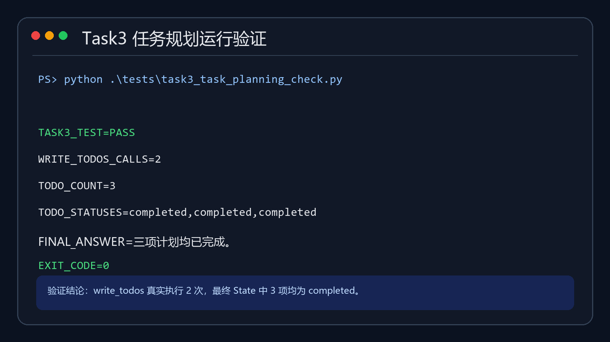

# Task3 学习笔记：任务规划与 `write_todos`

> 学习日期：2026-09-20<br>
> 对应课程：第 4 章《任务规划与分解——让 Agent 学会拆解复杂任务》<br>
> 本文内容：学习心得、知识归纳、代码运行记录、踩坑与解决办法

## 一、学习心得

这一章让我真正理解了“会调用工具”和“会完成复杂任务”之间的区别。模型即使能搜索、读写文件，也可能因为任务太长而漏掉步骤、重复劳动或提前结束。`TodoListMiddleware` 的价值不是替模型完成推理，而是给 Agent 增加一个可持续更新的外部任务清单：先拆分目标，再逐项执行，并让 `pending → in_progress → completed` 的状态变化保持可见。

我还认识到，Todo 并不是任何任务都必须开启的功能。简单问答如果先生成五六条计划，反而会增加模型调用、延迟和 Token 消耗；只有长程、多阶段、容易遗漏步骤，或者产品界面需要展示进度时，任务规划才真正有价值。生产级 Agent 的关键不是功能越多越好，而是根据任务选择合适的中间件。

本次实验也让我看到“模型说自己调用了工具”和“运行时真的收到结构化工具调用”是两回事。某些兼容接口会让模型输出一段看起来像 `write_todos` 的文字，却没有产生真正的 `tool_calls`，这时 `todos` 状态不会改变。判断 Agent 是否完成规划，必须检查工具调用记录和最终 State，不能只阅读模型回答。

## 二、为什么 Agent 需要任务规划

简单任务通常只有一个动作：

```text
询问天气 → 调用天气工具 → 返回结果
```

复杂研究任务则可能包含：

```text
明确目标
→ 搜索多个来源
→ 阅读与筛选资料
→ 保存中间结果
→ 建立对比维度
→ 撰写报告
→ 检查遗漏与引用
```

没有规划时，Agent 常见的问题包括：

1. **遗漏步骤**：还没有收集证据就直接写结论。
2. **重复劳动**：忘记已经搜索过的内容，再次调用相同工具。
3. **失去主线**：对话历史变长后，不知道下一步应该做什么。
4. **提前结束**：生成了一份文字，但没有检查测试和验收条件。
5. **进度不可见**：用户只能看到转圈，不知道 Agent 当前在做什么。

任务清单为长任务提供了一个短小而稳定的“北极星”。即使大量工具结果被卸载到文件、旧对话被总结，Agent 仍然可以从 `todos` 状态知道已经完成什么、当前在做什么、下一步是什么。

## 三、v0.7 中如何启用任务规划

Deep Agents v0.7 默认不再为每个 Agent 安装 Todo 能力。需要显式加入 `TodoListMiddleware`：

```python
from deepagents import create_deep_agent
from langchain.agents.middleware import TodoListMiddleware

agent = create_deep_agent(
    model=model,
    middleware=[TodoListMiddleware()],
)
```

启用后，中间件会同时提供三样东西：

| 能力 | 作用 |
|---|---|
| `write_todos` 工具 | 创建或更新任务清单 |
| `todos` State | 保存任务内容和状态 |
| 规划提示词 | 引导模型在复杂任务中先规划再行动 |

必须注意：**工具存在不代表模型一定会调用它**。是否调用仍取决于任务复杂度、系统提示词、模型能力以及接口对结构化工具调用的支持程度。

## 四、Todo 数据结构和状态流转

一条 Todo 最核心的字段是：

```python
{
    "content": "运行测试并记录退出状态",
    "status": "pending",
}
```

三种状态：

| 状态 | 含义 |
|---|---|
| `pending` | 已经计划，但尚未开始 |
| `in_progress` | 当前正在执行 |
| `completed` | 已执行并确认完成 |

标准状态变化是：

```text
pending → in_progress → completed
```

计划应该写成可验证动作，而不是模糊愿望：

```text
不清楚：研究 LangGraph
更清楚：搜索 LangGraph 官方架构文档并保存来源 URL

不清楚：把代码做好
更清楚：运行 pytest，确认退出码为 0，并记录测试数量
```

执行过程中可以动态调整 Todo。例如发现原计划缺少引用检查，可以新增“逐条核对来源链接”；发现某一步不再相关，也应该更新清单，而不是留下永远无法完成的待办。

## 五、Todo、文件系统和对话总结的关系

这三个机制解决不同问题：

| 机制 | 回答的问题 |
|---|---|
| Todo | 任务有哪些步骤，现在进行到哪里？ |
| 虚拟文件系统 | 资料、中间结果和最终产物放在哪里？ |
| 对话总结 | 历史太长时，哪些关键信息要保留在当前上下文？ |

它们的协作方式是：

```text
Todo 保存短小的任务状态
        ↓
文件系统保存完整资料和中间产物
        ↓
对话总结压缩旧消息，但 Todo 仍保存在 Agent State 中
```

因此，Todo 不能代替文件。把几千行搜索结果写进 Todo 会破坏它作为进度锚点的作用；Todo 应保持简洁，详细证据应保存为文件。

## 六、主 Agent 与子 Agent 的 Todo 边界

- 默认 `general-purpose` 子 Agent 可以继承主 Agent 显式加入的 Todo 配置，但它维护自己的任务状态。
- 通过 `subagents=[...]` 声明的专业子 Agent 拥有独立 Middleware 栈；如果它也需要规划，应在自己的配置中加入 `TodoListMiddleware`。
- 子 Agent 不会自动读取或修改主 Agent 已经生成的 Todo 清单。

这意味着“继承规划能力”不等于“共享同一张任务表”。主 Agent 负责总体项目计划，子 Agent 可以维护自己的局部执行计划，最后只把结果返回给主 Agent。

## 七、可复现代码

本仓库提供两份代码：

1. [真实模型示例](../examples/task3-task-planning-demo.py)：从环境变量读取 OpenAI 兼容模型配置，实际创建 Deep Agent。
2. [确定性测试](../tests/task3_task_planning_check.py)：使用可产生结构化工具调用的测试模型，验证 `write_todos` 和 `todos` State 的真实执行路径。

模型配置只从环境变量读取：

```text
MODEL_API_KEY
MODEL_BASE_URL
MODEL_NAME
```

代码只打印 `PRESENT (values hidden)`，不会显示或提交完整 Key。

### 确定性测试的核心过程

测试模型依次产生：

```text
第 1 次 write_todos：创建 3 个 pending
第 2 次 write_todos：把同样 3 项更新为 completed
最终回答：三项计划均已完成
```

然后测试直接断言：

```python
assert result["todos"] == COMPLETED
assert result["messages"][-1].content == "三项计划均已完成。"
```

这不是用文字模拟工具调用，而是让 Agent 图真正执行 `write_todos`，再读取最终 State。

## 八、代码运行记录

### 1. 环境版本

```text
Python 3.13.13
deepagents 0.7.13
langchain 1.4.0
```

### 2. 执行命令

```powershell
$env:PYTHONUTF8 = "1"
& "C:\Users\win\Desktop\生产级Agent开发学习\.venv\Scripts\python.exe" `
  ".\tests\task3_task_planning_check.py"
```

### 3. 实际输出

```text
TASK3_TEST=PASS
WRITE_TODOS_CALLS=2
TODO_COUNT=3
TODO_STATUSES=completed,completed,completed
FINAL_ANSWER=三项计划均已完成。
EXIT_CODE=0
```

结果说明：`TodoListMiddleware` 已成功注入 `write_todos`；工具真实执行两次；最终 State 中存在三条 Todo，且全部为 `completed`。



## 九、踩坑与填坑记录

### 坑 1：在 v0.7 中以为 `write_todos` 默认存在

**现象**：系统提示词要求模型规划，但 Agent 工具列表中没有 `write_todos`。

**原因**：v0.7 将 Todo 从默认固定成本改成按需启用。

**解决**：显式加入：

```python
middleware=[TodoListMiddleware()]
```

### 坑 2：上游模型临时返回 503

**现象**：真实模型实验第一次返回：

```text
HTTP 503 service_unavailable
```

**原因**：兼容服务当时没有可用的目标模型路由。这说明“环境变量存在”和“模型此刻可用”是两件事。

**解决**：重新请求 `/models` 检查当前模型列表，并用一个最小聊天请求验证连通性；不要因为 `/models` 能返回就直接认定工具调用也可用。

### 坑 3：模型输出了工具调用文字，但没有产生结构化 tool_calls

**现象**：回答中出现类似：

```text
invoke tool write_todos with todos is [...]
```

但运行结果为：

```text
tool_calls=[]
todos=[]
```

**原因**：模型或 OpenAI 兼容网关只是输出了描述工具调用的文本，没有返回符合协议的 `tool_calls` 字段。LangGraph 不会把普通文本当成工具执行。

**解决**：

1. 用最小工具调用测试验证模型和网关是否支持结构化 Tool Calling。
2. 检查 `result["messages"]` 中的真实 `tool_calls`。
3. 检查最终 `result["todos"]`，不要只相信最终自然语言。
4. 使用确定性测试模型分离验证“框架逻辑”和“外部模型兼容性”。

### 坑 4：模型没有完成全部 Todo

**现象**：模型创建了三项计划，但只把前两项更新为 `completed`，第三项仍是 `pending`，随后就生成了最终回答。

**原因**：Todo 是模型可用的工具，不是框架强制执行的状态机。模型仍可能漏调或错误调用。

**解决**：在交付前加入状态验收：只有所有必需 Todo 都为 `completed`，并且产物与测试证据存在，才允许报告完成。关键任务还可以结合后续章节的 Rubric 或应用侧完成门。

### 坑 5：Windows 终端中文输出乱码

**现象**：Todo 内容和最终回答显示乱码。

**解决**：在运行前设置：

```powershell
$env:PYTHONUTF8 = "1"
```

同时确保源文件和 Markdown 使用 UTF-8 保存。

### 坑 6：把 API Key 写进代码或运行记录

**解决**：Key 只通过环境变量传入；公开记录只写 `PRESENT`，不输出真实值，也不提交 `.env`。

## 十、我对生产级任务规划的理解

生产环境不能只看 Agent 是否“列了一张清单”，还应该检查：

1. Todo 是否覆盖用户的全部明确要求。
2. 每一步是否是可执行、可验证的动作。
3. 状态是否与真实工具结果一致。
4. 失败后是否更新计划，而不是直接跳过。
5. 对话压缩后是否仍能恢复当前进度。
6. 主 Agent 和子 Agent 的计划边界是否清楚。
7. 最终回答前是否有独立的完成门。

我的总结是：

```text
Todo 负责保持方向，不负责证明结果；
工具输出和测试证据负责证明执行；
验收门负责决定能否宣布完成。
```

## 十一、课程反馈

这一章从“为什么需要规划”讲到 `TodoListMiddleware` 的实现来源，帮助我把 Deep Agents 的 Harness 能力和 LangChain Middleware 机制连接起来。建议学习时增加两组对照实验：一组是不开启 Todo 的复杂任务，另一组是开启 Todo 后比较工具轨迹和完成率；同时加入“模型只输出工具调用文字但没有真正调用”的失败案例，可以更直观地区分模型回答、工具协议和 Agent State。

## 十二、资料来源

- Datawhale《Deep Agents 实战》：<https://github.com/datawhalechina/deepagents-in-action>
- 第 4 章《任务规划与分解》：<https://datawhalechina.github.io/deepagents-in-action/chapters/ch04-task-planning/>
- Deep Agents 官方文档：<https://docs.langchain.com/oss/python/deepagents/overview>
- LangChain Middleware 文档：<https://docs.langchain.com/oss/python/langchain/middleware>

本文是学习过程中的原创理解、实验结果和踩坑整理。课程概念及引用资料来源已在上方标注。
